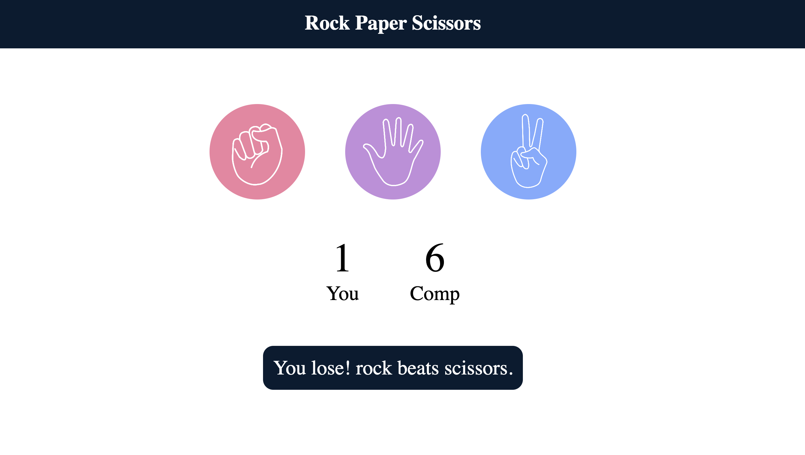

# Rock Paper Scissors Game

A modern, interactive Rock Paper Scissors game built with HTML, CSS, and JavaScript.

## Overview

Play the classic Rock Paper Scissors game against the computer. The game keeps track of your score and the computer's score in real-time.



## Features

- 🎮 **Interactive Gameplay** - Click on rock, paper, or scissors to make your choice
- 📊 **Score Tracking** - Automatic score updates for both player and computer
- 🎨 **Modern Design** - Clean, professional UI with smooth animations
- 📱 **Responsive** - Works seamlessly on desktop and mobile devices
- ⚡ **Instant Feedback** - Real-time game results and messages

## Game Rules

- **Rock** beats **Scissors**
- **Scissors** beats **Paper**
- **Paper** beats **Rock**
- If both players choose the same option, it's a **draw**

## How to Play

1. Open `index.html` in your web browser
2. Click on one of the three choices:
   - **Rock** 
   - **Paper** 
   - **Scissors** 
3. The computer automatically makes its choice
4. The result will display showing who won
5. Scores update automatically
6. Click **RESET GAME** to start over with scores at 0-0

## File Structure

```
Rock-Paper-Scissors/
├── index.html       # Main HTML file with game structure
├── style.css        # Styling and layout
├── script.js        # Game logic and interactions
├── images/          # Game choice images
│   ├── rock.png
│   ├── paper.png
│   └── scissors.png
└── README.md        # This file
```

## Technologies Used

- **HTML5** - Semantic markup and structure
- **CSS3** - Modern styling with gradients and animations
- **JavaScript (ES6)** - Game logic and DOM manipulation

## Game Components

### HTML Elements

- `.choice` - Clickable choice buttons (rock, paper, scissors)
- `#user-score` - Player's score display
- `#comp-score` - Computer's score display
- `#msg` - Game message/result display
- `.reset` - Reset button to start a new game

### JavaScript Functions

- `genComputer()` - Generates random computer choice (0-2)
- `computerChoice()` - Returns the computer's string choice
- `draw()` - Displays draw message
- Event listeners on choices for user interaction

## How to Customize

### Change Colors

Edit the choice background colors in `style.css`:

```css
.choice.rock {
  background: #ff6b9d;
}
.choice.paper {
  background: #c084fc;
}
.choice.scissors {
  background: #60a5fa;
}
```

### Modify Button Styling

Update the `.reset` button in `style.css` to change its appearance.

### Adjust Game Logic

Edit the game conditions in `script.js` to modify win/lose/draw rules.

## Browser Support

- Chrome (latest)
- Firefox (latest)
- Safari (latest)
- Edge (latest)

## Quick Start

1. Clone or download this repository
2. Open `index.html` in your browser
3. Start playing!

No installation or dependencies required.

## Future Improvements

- Add difficulty levels
- Implement best-of-3 or best-of-5 game modes
- Add sound effects
- Create a leaderboard
- Add animations for choices

## License

This project is open source and available for personal and educational use.

## Author

Created as a fun interactive game project.

---

**Enjoy the game! Have fun playing Rock Paper Scissors!** 🎮
